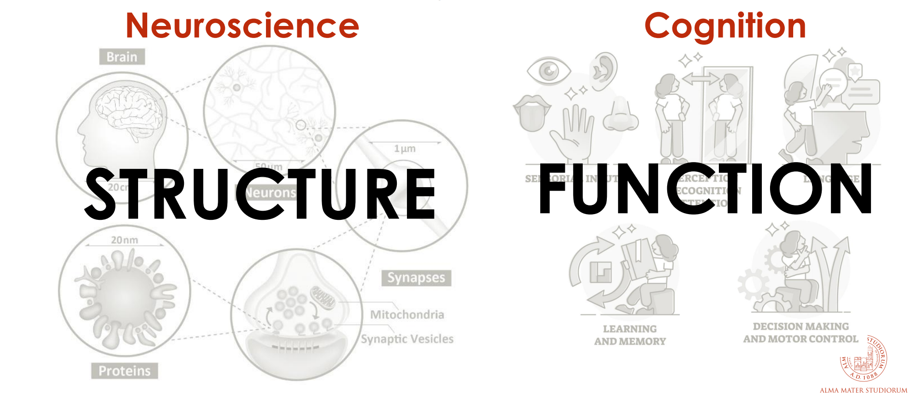
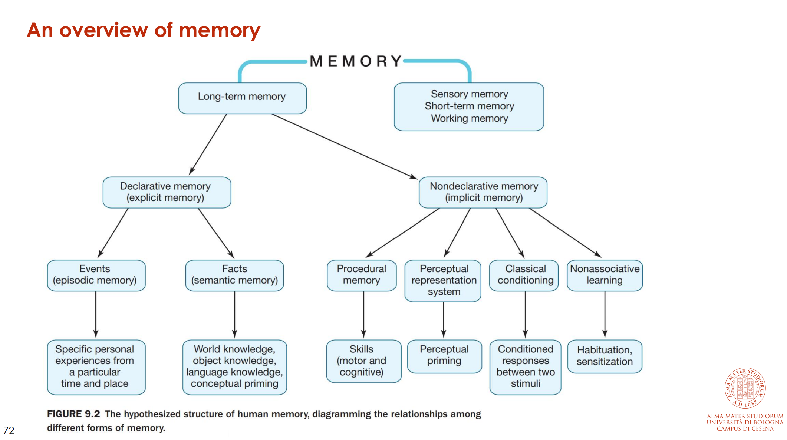
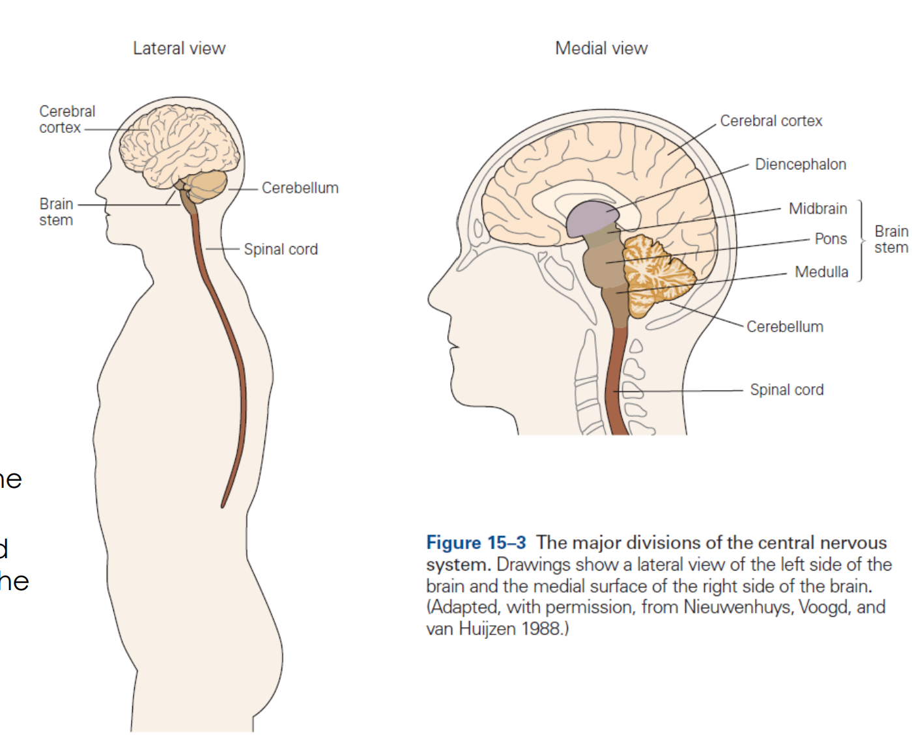
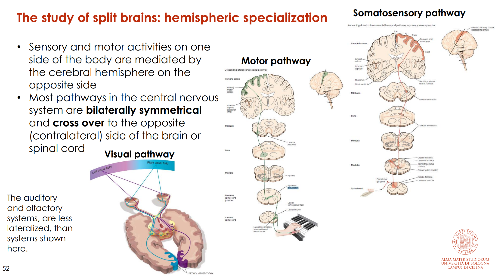
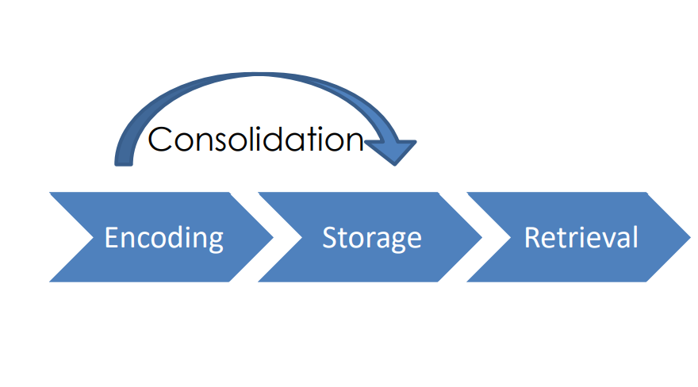

# What Is Cognitive Neuroscience?
### Bridging the Gap Between Brain and Mind
**Course:** Cognition and Neuroscience — University of Bologna, AY 2025/2026  
**Instructor:** Francesca Starita

---

## 📌 Overview

This lecture introduces the foundational definitions of **neuroscience**, **cognition**, and **cognitive neuroscience**, then explores the key question at the heart of the course: *Is the brain a good model for artificial intelligence?* It also establishes the relationship between **brain structure and function**, using landmark clinical cases and neuroscientific discoveries as evidence.

> 💡 **TA Note:** This lecture sets the conceptual groundwork for the entire course. If you understand why structure and function are inseparable — and why that matters for AI — you've grasped the central thread of this module.

---

## 🔑 Key Concepts

### Neuroscience
- **Definition:** The study of how the **nervous system is organized and functions**.
- A **multidisciplinary science** drawing from:
  - Physiology, Anatomy, Molecular biology
  - Developmental biology, Cytology
  - Computer science, Mathematical modeling

**Levels of investigation in neuroscience:**

| Level | Focus |
|---|---|
| **Molecular** | Molecular neuroanatomy; mechanisms of molecular signaling in the nervous system |
| **Cellular** | Study of neurons — morphology and physiological properties |
| **Neural circuits & systems** | How circuits form and function to generate behaviors (sensory perception, motor actions, etc.) |

---

### Cognition
- **Definition:** The range of mental processes relating to the **acquisition, storage, manipulation, and retrieval of information**.

**Cognitive processes include:**

| Process | Description |
|---|---|
| **Perception** | Taking in information from the environment through the senses |
| **Attention** | Focusing on a specific stimulus in the environment |
| **Learning** | Manipulating new information and integrating it with prior knowledge |
| **Memory** | Encoding, storing, and retrieving information |
| **Action** | Using perceived information to interact with the environment |
| **Language** | Understanding and expressing thoughts through spoken/written words |
| **Thought / Higher Reasoning** | Decision-making and problem-solving |

---

### Cognitive Neuroscience

> ⚠️ **Exam-Relevant** — Definition frequently asked in exams.

**Definition:** The **interdisciplinary field** that studies the **neural basis of cognition**, seeking to understand how the nervous system gives rise to mental processes.

$$\text{Cognitive Neuroscience} = \text{Neuroscience (Structure)} + \text{Cognition (Function)}$$

> 💡 **TA Note:** Think of it as the "bridge" discipline — neuroscience gives us the *hardware* map, cognitive science gives us the *software* map, and cognitive neuroscience tries to explain *how the hardware runs the software*.

> 📎 **Image Note:** This image is from **Slide 12** — "Cognitive Neuroscience: Structure + Function + Cognition Venn Diagram". Add the file as `images/slide_12_cognitive_neuroscience_venn.png` in the repo and it will load automatically.

---

## 🧠 Is the Brain a Good Model for AI?

This is the central debate of the lecture, discussed in the context of a landmark 2012 *Nature* article celebrating 100 years since Alan Turing's birth:

> Brooks R, Hassabis D, Bray D, Shashua A. *Turing centenary: Is the brain a good model for machine intelligence?* Nature. 2012;482(7386):462–3. doi: [10.1038/482462a](https://doi.org/10.1038/482462a)

---

### ✅ Arguments FOR Using the Brain as a Model

**Conceptual / Theoretical:**
- The human brain is the **existing proof** that general intelligence is possible at all.
- Studying animal cognition and its neural implementation provides a window into **different aspects of higher-level general intelligence**.

**Technical / Mechanistic:**
- **Functional similarities** exist between biological brains and artificial computations.
  - The **"all-or-none" firing** of neurons is analogous to **binary computation** in machines.
  - *(However, binary abstractions do not capture all the complexity inherent in the brain.)*
- Neuroscience can **inspire** new types of algorithms and architectures — **independent of** or **complementary to** purely mathematical/logic-based methods.
- Neuroscience can provide **validation**: a known algorithm found to be implemented in the brain gives strong support for its plausibility as a component of general intelligence.

> 💡 **TA Note:** The canonical example is the **artificial neural network** — directly inspired by the structure of biological neurons. Hebbian learning rules were also directly imported into machine learning.

---

### ❌ Arguments AGAINST Using the Brain as a Model

**Conceptual / Theoretical:**
- Modeling brains and computers on each other creates **circular thinking** that may prevent deeper novel insights.
- From an **engineering perspective**, what works is what matters — we need not enforce biological plausibility.
- We still **do not know** the detailed circuitry of any brain region well enough to reproduce it faithfully.

**Technical / Mechanistic:**

| Brain | Computer |
|---|---|
| Mind and brain are **not distinct entities** | Hardware and software are separable |
| "Software" (cognition) **emerges from** hardware (structure) | Software is programmed independently |
| Neurons use **biochemical signals**, not just electrical | Digital computation uses binary electrical signals |
| Communication occurs in **cycles** (recurrent), not linear chains | Classical architectures are feedforward/linear |
| **Limited memory capacity**, yet excellent at generalizing | Requires **vast memory** (large datasets) to generalize via statistical learning |

> 💡 **TA Note:** The point about **recurrent connections** is particularly relevant to AI — it directly motivated the design of **Recurrent Neural Networks (RNNs)** and attention mechanisms in Transformers, which attempt to mimic the feedback loops observed in biological neural circuits.
> 
> Reference: Kar et al. (2019), *Nature Neuroscience* — evidence that recurrent circuits are critical to object recognition in the ventral stream.

---

### 🔄 Biomimicry

**Definition:** The emulation of models, systems, and elements of nature to solve complex human problems.

Living organisms have evolved well-adapted structures over geological time through natural selection — and these can serve as inspiration for engineering solutions.

---

### 🔁 The Two-Way Street

> ⚠️ **Exam-Relevant** — The bidirectional relationship between AI and neuroscience.

- Not only can **neuroscience inspire AI**, but **AI can also provide insights into how brains function**.
- The two disciplines are mutually informing.

---

## 🏗️ Levels of Brain Emulation in AI

> ⚠️ **Exam-Relevant** — Know the two levels and their representative projects.

| Level | Approach | Example Project |
|---|---|---|
| **Structure** | Closely mimic or reverse-engineer the specifics of neural circuits | **Blue Brain Project** (Markram, 2006) — biologically detailed digital reconstructions of the mouse brain |
| **Function** | Mimic the computational/algorithmic level of neural systems | **DeepMind** (Hassabis & Legg, 2010) — general-purpose AI based on systems-level understanding of the brain |

> 💡 **TA Note:** Structure-level emulation is about *building a digital copy* of the brain; function-level emulation is about *capturing what the brain does algorithmically*, without necessarily replicating its biological substrate.

---

## 🔬 Structure and Function: The Evidence

**Core claim:** *Structure and function are intimately related in the nervous system. Cognitive functions emerge from the structure of the nervous system.*

**How do we know this?** — Through the study of **brain lesions**.

### Brain Lesion Studies

- **Focal brain damage** causes specific cognitive and behavioral deficits.
- Types of lesions studied:
  - *Naturally occurring:* tumors, strokes, degenerative diseases
  - *Surgically induced:* to treat epilepsy (Montreal procedure)
  - *Experimentally caused:* only in animals

> ⚠️ **Exam-Relevant** — Brain lesions provide **causal evidence** on the relation between structure and function — they show which region is *necessary* for a given behavior.

---

## 🧩 Brain Structure

### Overview of the Brain's 6 Subdivisions

The brain is composed of the following subdivisions, largely symmetrical along the midline:

1. **Medulla** — Brainstem
2. **Pons** — Brainstem
3. **Midbrain** — Brainstem
4. **Cerebellum**
5. **Diencephalon** — Thalamus & Hypothalamus
6. **Telencephalon** — Cerebral Hemispheres

---

### The Telencephalon (Cerebral Hemispheres)

The **largest part** of the human brain. Consists of:
- **Cerebral cortex** — grey matter (neuronal cell bodies)
- **White matter** — axons and glial cells
- **Three deep-lying structures** regulating cortical activity:
  - **Basal ganglia**
  - **Amygdala**
  - **Hippocampus**

---

### Cerebral Cortex

- Two symmetrical **hemispheres** connected via the **corpus callosum**
- Divided into **4 lobes** separated by prominent sulci
- Lobes have **variety of functional roles** in neural processing
- Cognitive brain systems are composed of **distributed networks** across lobes
- Each functional system is **hierarchically organized**:
  - Areas designated as **primary, secondary, or tertiary** based on their sequence in the processing pathway

---

## 🔄 Split Brains & Hemispheric Specialization

> ⚠️ **Exam-Relevant** — Classic topic on structure–function relationships.

### The Corpus Callosum
- The **largest white matter structure** in the brain
- Primary communication highway between the two hemispheres
- *Callosotomy* (surgical severing) = "split-brain" patients

### Key Facts on Lateralization

- Sensory and motor activities on **one side of the body** are mediated by the **contralateral hemisphere**
- Most CNS pathways **cross over** (decussate) to the opposite side
  - Visual, somatosensory, and motor pathways are highly lateralized
  - Auditory and olfactory systems are **less lateralized**
- In healthy individuals, information from both hemispheres is **integrated** via the corpus callosum into a unified representation

### Split-Brain Patients
- Inter-hemispheric communication is **impaired** → reveals each hemisphere's independent specializations
- Under controlled experimental conditions, each hemisphere can be probed independently

---

## 🗣️ Language & the Left Hemisphere

> ⚠️ **Exam-Relevant** — Broca's Area, Wernicke's Area, and double dissociation.

### Left Hemisphere Dominance for Language
- Language and speech reside primarily in **one hemisphere** (almost never both)
- The **left hemisphere** is dominant for speech production in **~96% of people**
- In split-brain patients, speech is produced from the left hemisphere
- A small number of documented cases show residual right-hemisphere language capacity (restricted to **lexical comprehension** — the mind's "dictionary")

### Broca's Area — Expressive Aphasia

| | |
|---|---|
| **Who** | Paul Broca, 1861 — patient "Tan" |
| **Lesion location** | Left **inferior frontal lobe** |
| **Deficit** | **Impaired language production** (non-fluent/agrammatic aphasia) |
| **Preserved** | Language comprehension |
| **Patient awareness** | Usually aware of their deficit |

### Wernicke's Area — Receptive Aphasia

| | |
|---|---|
| **Who** | Carl Wernicke, 1876 |
| **Lesion location** | Left **superior temporal gyrus** |
| **Deficit** | **Impaired language comprehension** |
| **Preserved** | Fluent speech — but content is nonsensical (fluent aphasia) |
| **Patient awareness** | Often unaware of incorrect productions |

### Double Dissociation

> ⚠️ **Exam-Relevant** — Definition and example must be mastered.

**Definition:** Patient/group 1 is impaired on Task X (but not Y) **AND** patient/group 2 is impaired on Task Y (but not X).

This is the gold-standard evidence for two **distinct, separable cognitive processes**.

| Patient Type | Lesion | Impaired | Preserved |
|---|---|---|---|
| Broca's aphasia | Left inferior frontal lobe | Language **production** | Language comprehension |
| Wernicke's aphasia | Left temporal lobe | Language **comprehension** | Language production (jumbled) |

> 💡 **TA Note:** Double dissociation is crucial because a *single dissociation* could be explained by one process being just "harder" than another. Double dissociation proves functional independence.

---

## 🔧 Surgical Lesions: The Montreal Procedure

### Wilder Penfield (1891–1976)
- Developed the **Montreal procedure** to treat epilepsy: surgically destroyed seizure-producing neurons
- Used **electrical stimulation** of the brain while patients were awake → mapped responses
- Created **somatosensory and motor cortex maps** (Penfield & Jasper, 1954)

### Donald O. Hebb (1904–1985)
- Worked with Penfield studying surgery's effects on the brain
- Core belief: *psychology and biology cannot be separated*
- Famous principle: **"Cells that fire together, wire together"**
  - Neurons that activate together form stronger connections → **Hebbian plasticity**
  - This principle was directly used in the design of **artificial neural networks**

> ⚠️ **Exam-Relevant** — Hebbian learning as a bridge between neuroscience and AI.

---

## 🧠 The Hippocampus & Memory: Patient H.M.

> ⚠️ **Exam-Relevant** — H.M.'s case is foundational for understanding memory systems.

### Background
- **Brenda Milner** (1918–) worked with Penfield's surgical patients
- Patients complained of mild memory loss post-surgery
- Milner showed the **extent of memory deficit depended on how much of the medial temporal lobe** was removed

### What H.M. Taught Us

**H.M. had bilateral removal of his medial temporal lobes (including hippocampus).**

| Memory Type | Outcome in H.M. |
|---|---|
| New long-term memories | ❌ Could NOT form (anterograde amnesia) |
| Short-term memory | ✅ Normal |
| Procedural memory (motor skills) | ✅ Could learn new skills (e.g., mirror drawing) |
| Memory of *practicing* the skill | ❌ Could NOT remember |

**Key conclusions:**
- Memory is **separable** from perception and intellectual functions (which remained intact in H.M.)
- The **medial temporal lobes** are necessary for:
  - Forming long-term (declarative) memories
  - Transferring information from short-term to long-term memory
- The medial temporal lobes are **NOT necessary** for:
  - Short-term memory retention
  - Procedural/motor learning

> 💡 **TA Note:** H.M. demonstrated a **dissociation between explicit memory** (consciously remembering *that* you learned something) and **implicit/procedural memory** (the actual learned skill). This is the first clean experimental evidence for **multiple memory systems** — each with different neural substrates.

---

## 💾 Memory Systems

### Definition
> **Memory:** The process of encoding, storage, and retrieval of information.

*Learning* = acquiring new information; *Memory* = the outcome of learning. They are deeply intertwined.

### Basic Steps of Memory Processing

1. **Encoding** — Processing of incoming information creating memory traces:
   - *Acquisition:* Sensory stimuli enter short-term memory
   - *Consolidation:* Stabilization over time (days to months/years) → long-term memory
2. **Storage** — "Permanently" recording the information
3. **Retrieval** — Accessing stored information to form a conscious representation or execute a learned behavior

> 📎 **Image Note:** This image is from **Slide 72–73** — "An Overview of Memory". Add the file as `images/slide_72_memory_overview.png` in the repo and it will load automatically.

### Neural Plasticity and Memory

> ⚠️ **Exam-Relevant** — Plasticity mechanisms underlie all forms of memory.

**Plasticity:** Neural connections can be modified by experience and learning.

| Type | Nature | Duration |
|---|---|---|
| **Short-term plasticity** (Hebbian) | Functional/physiological changes — increase/decrease synaptic effectiveness | Seconds to hours |
| **Long-term plasticity** | Structural changes — pruning of existing synapses or growth of new ones | Days and beyond |

---

## 🧩 The Frontal Lobe & Higher Cognition

### Ventromedial Prefrontal Cortex (vmPFC)
- Part of the **prefrontal cortex**
- Crucial for **cognitive/affective control**
- The most ventral part is the **orbitofrontal cortex** (above the bony orbits of the eyes)

### Patient Phineas Gage (1823–1860)

September 13, 1848 — a railway construction accident drove an iron rod through Gage's skull, destroying his vmPFC while leaving him physically alive.

**Outcome:**
- Dramatic **personality changes** — previously responsible and socially adept, Gage became impulsive, irreverent, and unable to make sound decisions
- Perception and intellect were largely **preserved**
- Case became landmark evidence that the **frontal lobe is involved in personality, social behavior, and decision-making**

> 📎 **Image Note:** This image is from **Slide 79** — "Patient Phineas Gage". Add the file as `images/slide_79_phineas_gage.png` in the repo and it will load automatically.

---

## 👁️ The Parietal Lobe & Attention: Hemispatial Neglect

- **Hemispatial neglect:** A disorder of attention — patients systematically ignore one half of the world
- Most commonly caused by lesion to the **right parietal lobe** → **left-sided neglect**
- Symptoms:
  - Poor spatial awareness on the neglected side
  - Impaired attention to environment
  - Difficulty interpreting visual scenes as a whole

> 💡 **TA Note:** This is a spectacular example of structure–function correspondence: damage a specific parietal region → lose attention to an entire half of space. It also suggests that **attention** is not purely a top-down volitional process but depends on dedicated neural substrates.

---

## 🖼️ Figures & Diagrams

> 📎 **Image Note:** This image is from **Slide 46** — "The Brain: 6 Subdivisions". Add the file as `images/slide_46_brain_subdivisions.png` in the repo and it will load automatically.

> 📎 **Image Note:** This image is from **Slide 52** — "Hemispheric Specialization Pathways". Add the file as `images/slide_52_hemispheric_pathways.png` in the repo and it will load automatically.

> 📎 **Image Note:** This image is from **Slide 74** — "Basic Steps of Memory Processing". Add the file as `images/slide_74_memory_steps.png` in the repo and it will load automatically.

---

## ⚠️ Exam-Relevant Topics

- **Define cognitive neuroscience** and explain how it bridges neuroscience and cognition (Slides 7–12)
- **Brain as a model for AI** — know both sides of the argument; be ready to give 2–3 points each way (Slides 18–32)
- **Levels of brain emulation in AI** — Blue Brain Project (structure) vs DeepMind (function) (Slide 33)
- **Double dissociation** — definition and the Broca/Wernicke example (Slides 59–63)
- **Hebbian plasticity** — "cells that fire together, wire together" and its link to ANNs (Slide 66)
- **Patient H.M.** — what his case proves about multiple memory systems and the role of the hippocampus (Slides 67–70)
- **Brain lesions as causal evidence** — why lesion studies are methodologically important (Slides 43, 86–88)
- **Hemispatial neglect** — parietal lobe and attention (Slides 82–83)
- **Revision questions from Slide 96** — these are exam-style questions:
  1. Analyze the relationship between neuroscience and AI. To what extent is the brain a good model for machine intelligence?
  2. Choose an example from cognitive neuroscience to illustrate that cognition directly emerges from brain structure.

---

## 📚 Recommended Readings

- Brooks R, Hassabis D, Bray D, Shashua A. *Turing centenary: Is the brain a good model for machine intelligence?* Nature. 2012;482(7386):462–3. doi: [10.1038/482462a](https://doi.org/10.1038/482462a)
- Gazzaniga, Ivry, Magnum. *Cognitive Neuroscience: The Biology of the Mind*
  - **Chapter 4** — Hemispheric Specialization
  - **Chapter 9** — Memory

---

## 📝 Summary

- **Neuroscience** = study of nervous system structure and function; **Cognition** = mental processes for handling information; **Cognitive Neuroscience** = the bridge between the two.
- The brain is a **double-edged model** for AI: it provides proof-of-concept for general intelligence and inspires algorithms, but differs fundamentally from computers in its substrate, recurrence, and memory architecture.
- Two levels of brain emulation in AI: **structural** (Blue Brain) and **functional** (DeepMind).
- **Structure and function are inseparable** in the nervous system — every cognitive function has a neural correlate.
- Key evidence comes from **lesion studies**: Broca/Wernicke aphasia (language), H.M. (memory), Phineas Gage (decision-making), hemispatial neglect (attention).
- **Hebbian plasticity** ("cells that fire together, wire together") is the biological basis of learning and directly inspired artificial neural network design.
- Memory is not monolithic: the hippocampus supports **declarative long-term memory** but not procedural learning — multiple systems, multiple substrates.
